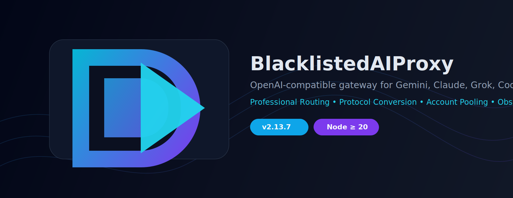
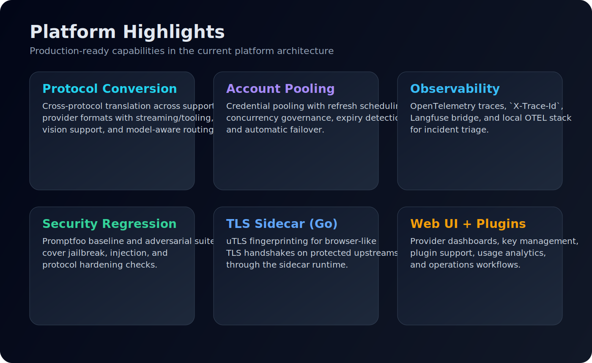
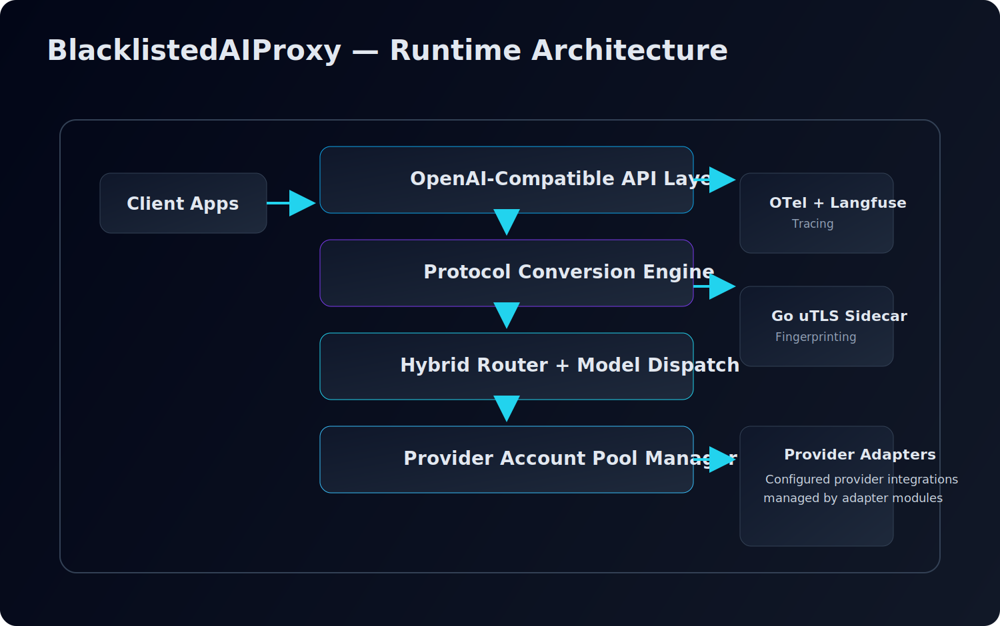

<div align="center">
  
</div>

<div align="center">

# BlacklistedAIProxy

**OpenAI-compatible gateway for Gemini, Claude (via Kiro adapter), Grok, Codex, Qwen, Kimi, and more.**

[](https://github.com/crazyrob425/BlacklistedAIProxy)
[](https://www.gnu.org/licenses/gpl-3.0)
[](https://nodejs.org/)
[](https://hub.docker.com/r/crazyrob425/blacklisted-api)
[](https://github.com/crazyrob425/BlacklistedAIProxy/actions)

[Quick Start](#quick-start) • [Architecture](#architecture) • [Features](#feature-overview) • [Docs](#documentation)

</div>

---

## Why BlacklistedAIProxy

BlacklistedAIProxy unifies multiple client-bound AI providers behind a single OpenAI-compatible endpoint, so your apps and tooling can integrate once and route anywhere.

### What it solves
- Normalizes OpenAI, Claude, and Gemini-style payloads with protocol conversion
- Routes requests across provider/account pools with health-aware failover
- Supports streaming, tool/function calls, vision, and model-aware dispatch
- Adds observability (OpenTelemetry + optional Langfuse) and security regression testing (Promptfoo)
- Provides a Web UI for account management, logs, plugins, and configuration

### Production readiness
- Observability: OpenTelemetry tracing with `X-Trace-Id` and optional Langfuse integration
- Reliability: provider pool failover, token refresh queueing, and concurrency controls
- Security quality checks: Promptfoo baseline and adversarial security suites
- Deployment support: Docker runtime, compose flows, and environment-based configuration

---

## Brand & Visual Identity

<div align="center">
  
</div>

<div align="center">
  
</div>

---

## Feature Overview

| Capability | Status | Details |
|---|---|---|
| Provider coverage | ✅ | Gemini CLI, Claude (via Kiro adapter), Grok, Codex, Qwen, Kimi (+ existing adapters) |
| Protocol bridge | ✅ | OpenAI ↔ Claude ↔ Gemini conversion, streaming-aware |
| Account pool manager | ✅ | Round-robin, token refresh queue, deduping, concurrency control, failover |
| TLS bypass sidecar | ✅ | Go `uTLS` service for browser-like TLS fingerprints |
| Web UI + plugin system | ✅ | AI Monitor, Model Usage Stats, API Potluck, Langfuse bridge |
| Observability | ✅ | OpenTelemetry traces, `X-Trace-Id`, optional Langfuse events |
| Security quality gates | ✅ | Promptfoo baseline + red-team security suites |
| Docker deployment | ✅ | Docker run + compose workflows |
| Desktop shell | ✅ | WRB Tauri dashboard included in `/desktop/wrb-dashboard-tauri` |

---

## Architecture

<div align="center">
  
</div>

---

## Quick Start

### Docker (recommended)

```bash
docker run -d \
  -p 3000:3000 \
  -p 8085-8086:8085-8086 \
  -p 1455:1455 \
  -p 19876-19880:19876-19880 \
  --restart=always \
  -v "$(pwd)/configs:/app/configs" \
  --name blacklistedapi \
  crazyrob425/blacklisted-api
```

Then open: `http://localhost:3000`

### Docker Compose

```bash
cd docker
mkdir -p configs
docker compose up -d
```

### Native run (Node.js >= 20)

**Linux/macOS**
```bash
chmod +x install-and-run.sh && ./install-and-run.sh
```

**Windows**
```bat
install-and-run.bat
```

---

## Connect OpenAI-Compatible Tools

Set base URL to `http://localhost:3000` for:
- Cherry Studio
- Continue.dev
- Cline
- OpenCode
- OpenClaw
- Any OpenAI-compatible SDK

---

## Provider Authorization Matrix

| Provider | Auth Method | Port |
|---|---|---|
| Gemini CLI | OAuth 2.0 PKCE | 8085 |
| Antigravity | OAuth 2.0 | 8086 |
| Claude (via Kiro adapter) | OAuth + Cookie | 19876-19880 |
| Codex | OpenAI OAuth | 1455 |
| Grok | xAI SSO Cookie | N/A |
| Qwen Code | Alibaba OAuth | N/A |
| Kimi K2 | Moonshot OAuth | N/A |

Primary config path: `configs/config.json`

---

## Key Configuration

```bash
MASTER_PORT=3100
API_PORT=3000
OTEL_ENABLED=true
LANGFUSE_PUBLIC_KEY=...
LANGFUSE_SECRET_KEY=...
PROVIDER_POOLS_FILE_PATH=./configs/provider_pools.json
```

Path examples:
```bash
# Gemini
curl http://localhost:3000/gemini/v1/chat/completions

# Claude (via Kiro adapter)
curl http://localhost:3000/kiro/v1/chat/completions

# Grok
curl http://localhost:3000/grok/v1/chat/completions

# Auto routing
curl http://localhost:3000/v1/chat/completions -d '{"model":"claude-opus-4-5"}'
```

---

## Testing

```bash
# full suite
npm test

# unit-focused runner
npm run test:unit

# integration-focused runner
npm run test:integration

# coverage
npm run test:coverage

# security red-team suite
npm run test:promptfoo:security
```

---

## Documentation

- [OpenClaw Config Guide](./docs/OPENCLAW_CONFIG_GUIDE.md)
- [Provider Adapter Guide](./docs/PROVIDER_ADAPTER_GUIDE.md)
- [OpenCode Config Example](./docs/OPENCODE_CONFIG_EXAMPLE.md)
- [Dependency Register](./docs/DEPENDENCY-REGISTER.md)
- [Governance Roadmap](./docs/GOVERNANCE.md)
- [Windows Beta Blueprint](./docs/WINDOWS_BETA_PRE_RELEASE.md)
- [WRB Tauri Desktop App](./desktop/wrb-dashboard-tauri/README.md)

---

## Compliance & Usage

BlacklistedAIProxy is provided for educational and research use. Ensure your usage follows provider terms, local laws, and responsible security practices.

---

## License

GPL-3.0 — see [LICENSE](./LICENSE).
